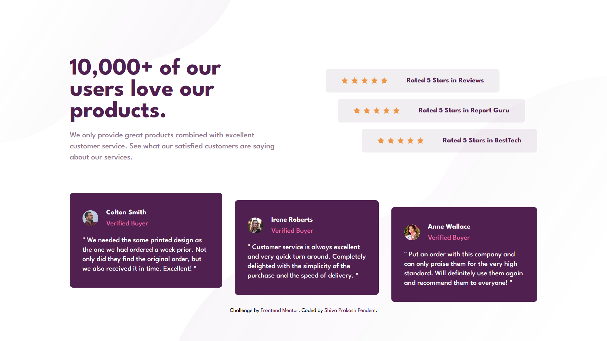

# Frontend Mentor - Social proof section solution

This is a solution to the [Social proof section challenge on Frontend Mentor](https://www.frontendmentor.io/challenges/social-proof-section-6e0qTv_bA). Frontend Mentor challenges help you improve your coding skills by building realistic projects.

## Table of contents

- [Overview](#overview)
  - [The challenge](#the-challenge)
  - [Screenshots](#screenshots)
  - [Links](#links)
- [My process](#my-process)
  - [Built with](#built-with)
  - [What I learned](#what-i-learned)
  - [Continued development](#continued-development)
  - [Useful resources](#useful-resources)
- [Author](#author)

## Overview

### The challenge

Users should be able to:

- View the optimal layout for the section depending on their device's screen size

### Screenshot

#### Desktop View

#### Mobile View

### Links

- Solution URL: [GitHub repo](https://github.com/shivaprakash-sudo/social-proof-section)
- Live Site URL: [Social Proof Section](https://shivaprakash-sudo.github.io/social-proof-section/)

## My process

### Built with

- Semantic HTML5 markup
- Flexbox
- CSS Grid
- Mobile-first workflow
- [Tailwind-css](https://tailwindcss.com/) - CSS framework

### What I learned

- Solving complex layouts using grid

### Continued development

- I'd like to solve more complex layouts using flex and grid.

### Useful resources

- [Tailwind-css docs](https://tailwindcss.com/docs/installation/play-cdn) - Again, official documentation for the win.

## Author

- Frontend Mentor - [@shivaprakash-sudo](https://www.frontendmentor.io/profile/shivaprakash-sudo)
